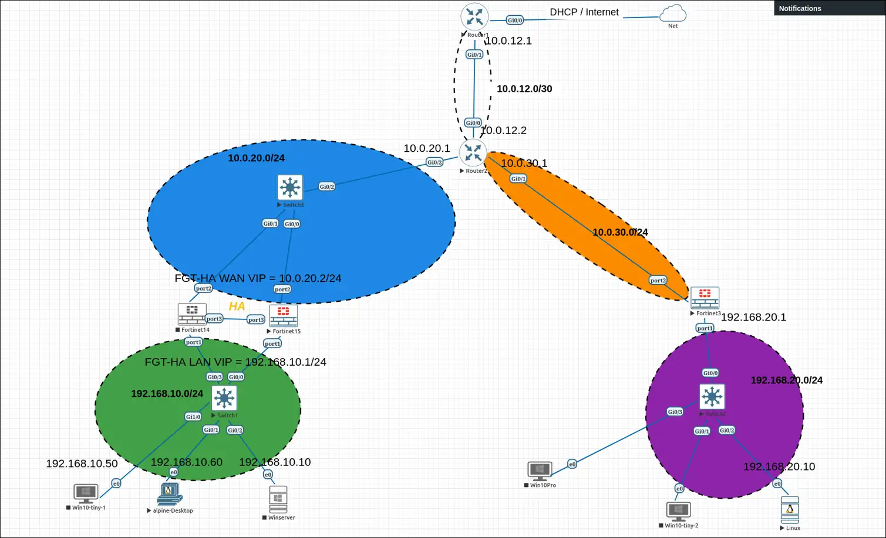
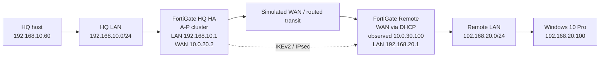
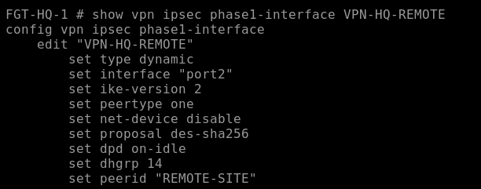
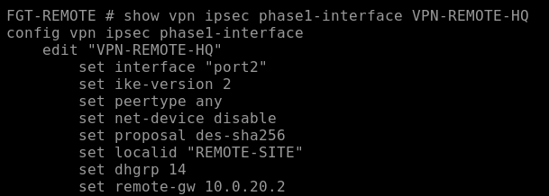

# FortiGate Multi-Site VPN & HA Lab

A two-site network lab built in **EVE-NG** during my 2026 PFA internship at **CBI**. The project validates a FortiGate **IKEv2/IPsec site-to-site VPN with a dynamically addressed branch**, bidirectional routing and firewall policy, application traffic across the tunnel, packet-level ESP verification, and **active-passive HA failover** at headquarters.

> **Scope:** This repository documents a controlled virtual lab. It is **not** CBI's internal network, a customer environment, or a production deployment. Credentials, PSKs, serial numbers, licensing identifiers, and other sensitive values are excluded or redacted.
>
> This is a personal portfolio publication by the author and does not represent an official statement or security baseline from CBI or any vendor. See [NOTICE.md](NOTICE.md).



## What was implemented

- Two private LANs: `192.168.10.0/24` (HQ) and `192.168.20.0/24` (remote)
- Two FortiGate VMs at HQ in active-passive HA
- One remote FortiGate with a WAN address learned by DHCP
- IKEv2/IPsec route-based site-to-site VPN
- Dynamic/dial-up responder at HQ matched by the IKE identity `REMOTE-SITE`
- Separate Internet NAT and inter-site VPN policy paths
- Bidirectional routing and firewall policies
- ICMP, TCP/3389, and interactive RDP validation
- Wireshark comparison of LAN-side RDP traffic with WAN-side ESP
- Controlled HA failover and post-failover VPN/routing verification

## Architecture



The branch's WAN address is dynamic, so HQ acts as a dial-up responder rather than relying on a fixed remote gateway. The branch presents the IKE identity `REMOTE-SITE`; HQ matches that identity.

More detail: [docs/architecture.md](docs/architecture.md)

## Key engineering issue: negotiated tunnel, broken return path

The tunnel negotiated successfully (`selectors(total,up): 1/1`), but traffic initially worked only from the remote site toward HQ. Packet capture and FortiGate flow debugging showed that the return packet reached the HQ VPN interface but was not transmitted as ESP.

The root cause was a manually configured HQ route to `192.168.20.0/24` through the generic dial-up parent VPN interface. The working fix was to:

1. remove that manual remote-LAN route at HQ;
2. enable dynamic IPsec route installation (`add-route`);
3. clear old sessions and renegotiate IKE.

After negotiation, FortiGate installed a peer-specific route associated with the active dynamic tunnel.

See [docs/troubleshooting.md](docs/troubleshooting.md).

## Validation

The final lab was validated at multiple layers:

| Check | Result |
|---|---|
| IKEv2/IPsec selector | `1/1` active on both peers |
| Routing | Correct remote subnet routes |
| ICMP | Bidirectional |
| TCP/3389 | Reachable |
| RDP | Interactive session established |
| Packet analysis | Private RDP visible on LAN; ESP visible on WAN |
| Internet access | Independent from both sites |
| HA failover | Secondary promoted and traffic recovered |
| Post-failover VPN | Selector and remote route restored |

Selected evidence:

### Dynamic-peer Phase 1

| HQ | Remote |
|---|---|
|  |  |

### Final routing

| HQ | Remote |
|---|---|
|  |  |

### Application and packet-level verification


### HA failover


See [docs/validation.md](docs/validation.md) for the validation sequence and commands.

## Repository layout

```text
.
├── README.md
├── LICENSE
├── NOTICE.md
├── SECURITY.md
├── CITATION.cff
├── configs/
│   ├── README.md
│   ├── fortigate-hq-primary.conf
│   ├── fortigate-hq-secondary-ha.conf
│   ├── fortigate-remote.conf
│   ├── router-r1.conf
│   ├── router-r2.conf
│   ├── switch-hq.conf
│   └── switch-remote.conf
├── docs/
│   ├── architecture.md
│   ├── troubleshooting.md
│   ├── validation.md
│   └── production-hardening.md
└── evidence/
    └── selected screenshots from final validation
```

## Lab configuration warning

The available FortiGate VM image used `des-sha256` for the validated lab tunnel. That configuration is retained in the sanitized lab files because it reflects what was actually tested.

**DES is not appropriate for production cryptographic protection.** A real deployment should use a supported current FortiOS release and modern proposals such as AES-GCM where compatible. See [docs/production-hardening.md](docs/production-hardening.md).

## Reproducing the main checks

Useful FortiGate commands:

```text
get system ha status
get vpn ipsec tunnel summary
get router info routing-table all
show vpn ipsec phase1-interface VPN-HQ-REMOTE
show vpn ipsec phase2-interface
show firewall policy 10
show firewall policy 11
diagnose sys ha checksum cluster
diagnose vpn tunnel list name VPN-HQ-REMOTE
```

For the encapsulation check:

1. Establish RDP from HQ (`192.168.10.60`) to remote Windows (`192.168.20.100`).
2. Capture the HQ LAN link and confirm the private TCP/3389 flow.
3. Capture the HQ WAN link and filter for ESP.
4. Confirm that WAN traffic uses outer FortiGate addresses rather than exposing the original private RDP flow.

For HA:

1. Confirm both HQ members are synchronized.
2. Start continuous ICMP across the VPN.
3. Stop the active HQ FortiGate.
4. Verify secondary promotion.
5. Confirm traffic recovery, selector `1/1`, and restoration of the remote route.

## Production gaps identified

This lab deliberately separates **what was validated** from **what should be deployed in production**. Important improvements include:

- modern IPsec cryptography;
- stronger/managed peer authentication or certificates;
- narrower firewall services instead of `ALL`;
- redundant HA heartbeat paths;
- current Fortinet IPsec HA synchronization settings;
- centralized logging/monitoring;
- configuration backups and change control;
- scalability testing for multiple branches.

Details: [docs/production-hardening.md](docs/production-hardening.md)

## References

- [Fortinet — Phase 1 configuration and dynamic IPsec route control](https://docs.fortinet.com/document/fortigate/8.0.0/administration-guide/790613/phase-1-configuration)
- [Fortinet — IPsec VPN in an HA environment](https://docs.fortinet.com/document/fortigate/7.6.6/administration-guide/111309/ipsec-vpn-in-an-ha-environment)
- [Fortinet — Encryption algorithms](https://docs.fortinet.com/document/fortigate/latest/administration-guide/238852/encryption-algorithms)
- [NIST FIPS 46-3 — Data Encryption Standard (withdrawn)](https://csrc.nist.gov/pubs/fips/46-3/final)
- [NIST SP 800-131A Rev. 2 — Transitioning the Use of Cryptographic Algorithms and Key Lengths](https://csrc.nist.gov/pubs/sp/800/131/a/r2/final)
- [EVE-NG](https://www.eve-ng.net/)

## Author

**Yassine El Ghazi**
Cybersecurity Engineering Student, UEMF / EIDIA

Project completed during a PFA internship at CBI, July-August 2026.
