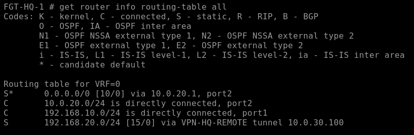

# Troubleshooting: one-way traffic on a dynamic IPsec peer

## Symptom

The IPsec tunnel negotiated correctly:

```text
selectors(total,up): 1/1
```

But only one direction worked:

```text
Remote -> HQ    worked
HQ -> Remote    failed
```

The remote FortiGate transmitted encrypted traffic, and HQ received it. Return traffic reached the HQ VPN interface but did not result in an outgoing ESP packet.

## What packet capture established

The HQ capture showed the full return flow up to the VPN interface:

```text
VPN-HQ-REMOTE in   192.168.20.10 -> 192.168.10.10  ICMP request
port1 out          192.168.20.10 -> 192.168.10.10  ICMP request
port1 in           192.168.10.10 -> 192.168.20.10  ICMP reply
VPN-HQ-REMOTE out  192.168.10.10 -> 192.168.20.10  ICMP reply
```

This ruled out several possible causes:

- endpoint gateway configuration;
- Phase 1 negotiation;
- Phase 2 selectors;
- basic WAN routing;
- the bidirectional firewall policy;
- peer-ID/local-ID matching.

## Root cause

HQ was configured as a dynamic/dial-up IPsec responder:

```text
set type dynamic
set net-device disable
```

At the same time, HQ had a manual route to the remote LAN using the generic parent VPN interface:

```text
config router static
    edit 10
        set dst 192.168.20.0 255.255.255.0
        set device "VPN-HQ-REMOTE"
    next
end
```

For this dynamic peer, that parent-interface route did not select the negotiated peer-specific tunnel correctly for return traffic.

## Fix

### 1. Remove the manual HQ remote-LAN route

```text
config router static
    delete 10
end
```

The normal HQ default route remains.

### 2. Enable dynamic IPsec route installation

On the dynamic HQ tunnel:

```text
config vpn ipsec phase1-interface
    edit "VPN-HQ-REMOTE"
        set add-route enable
    next
end
```

The validated lab also enabled route installation for the associated Phase 2:

```text
config vpn ipsec phase2-interface
    edit "VPN-HQ-REMOTE-P2"
        set add-route enable
    next
end
```

### 3. Clear stale sessions and renegotiate

```text
diagnose sys session clear
diagnose vpn ike restart
```

After the remote peer reconnected, HQ learned the remote-subnet route through the negotiated dynamic tunnel.

## Final route behavior

The important difference is that the working route is associated with the active negotiated peer rather than just the generic dial-up interface.



## Offload note

`auto-asic-offload disable` was used during troubleshooting so software flow debugging could expose the packet path. It was **not** the routing fix and is not required as a general production setting.

## Engineering lesson

A negotiated VPN does not prove that forwarding is correct. The investigation worked by separating:

1. IKE/Phase 2 state;
2. routing;
3. policy;
4. endpoint behavior;
5. actual packet movement.

That made it possible to isolate a routing/peer-selection issue rather than repeatedly changing cryptographic or firewall settings.
