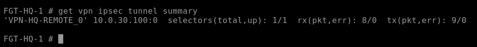
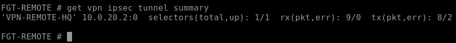
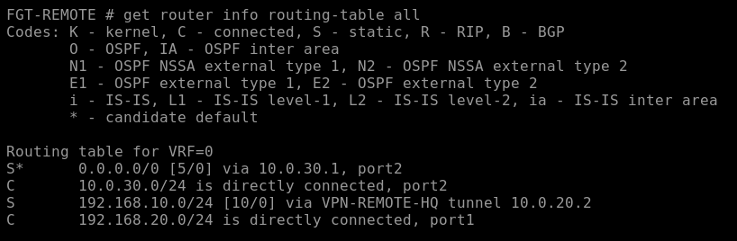
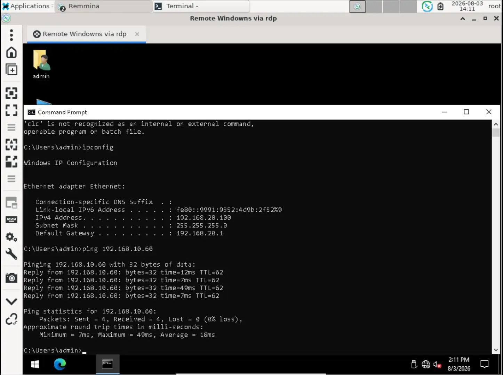
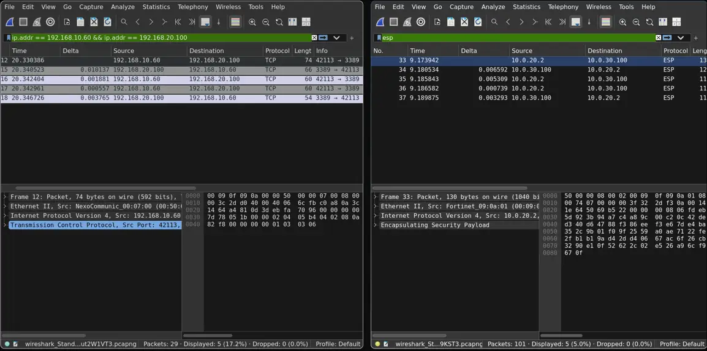
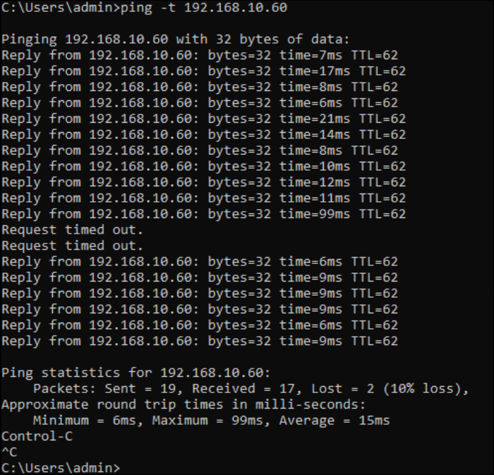
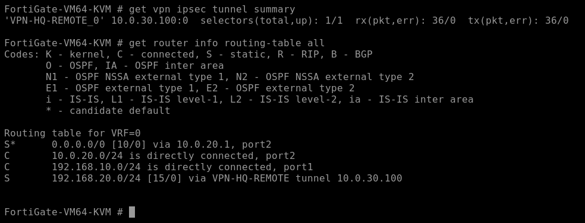

# Validation

The final design was checked at the VPN, routing, transport/application, packet, Internet, and HA layers.

## 1. VPN state

On both peers:

```text
get vpn ipsec tunnel summary
```

Expected final state:

```text
selectors(total,up): 1/1
```

| HQ | Remote |
|---|---|
|  |  |

## 2. Routing

```text
get router info routing-table all
```

HQ learned the remote LAN through the active negotiated dynamic VPN path. The remote side used its route to the HQ LAN through `VPN-REMOTE-HQ`.

| HQ | Remote |
|---|---|
|  |  |

## 3. ICMP and TCP/3389

Connectivity was checked with:

- ICMP between the protected LANs;
- TCP port `3389`;
- an interactive RDP session.



## 4. Packet-level IPsec verification

The same RDP activity was observed on two points:

- **LAN side:** original private TCP/3389 traffic;
- **WAN side:** ESP between FortiGate WAN addresses.



This verifies that the application traffic crossed the simulated WAN inside IPsec rather than in plaintext.

## 5. Independent Internet access

Internet access was tested separately at both sites. LAN-to-WAN policies use NAT, while LAN-to-VPN policies do not.

This separation avoids treating successful Internet NAT as evidence that VPN forwarding is correct.

## 6. HA failover

Before failure, both HQ FortiGate members were verified as synchronized. A continuous ping was then run while the active HQ unit was stopped.



The final test observed:

- secondary promotion to primary;
- recovery after two missed ICMP probes;
- restoration of the IPsec selector;
- restoration of the remote route.



## Acceptance summary

| Requirement | Evidence | Result |
|---|---|---|
| Interconnect both private LANs | ICMP, RDP, routes | Pass |
| Support dynamic branch WAN | DHCP + IKE identity matching | Pass |
| Preserve private addresses across VPN | Policy/NAT design + packet capture | Pass |
| Keep independent Internet access | Internet tests at both sites | Pass |
| Demonstrate real application | RDP | Pass |
| Verify ESP on WAN | LAN/WAN Wireshark comparison | Pass |
| Recover after HQ firewall failure | Continuous ping + HA promotion | Pass |
| Restore VPN forwarding after failover | Post-failover selector + route | Pass |

## Useful verification commands

```text
get system ha status
get vpn ipsec tunnel summary
get router info routing-table all
show vpn ipsec phase1-interface VPN-HQ-REMOTE
show vpn ipsec phase2-interface
show firewall policy 10
show firewall policy 11
diagnose sys ha checksum cluster
diagnose vpn tunnel list name VPN-HQ-REMOTE
```
